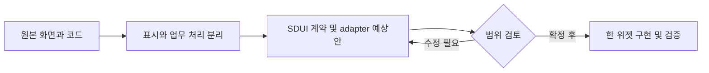

# ui-inspector — SDUI 위젯 후보

목표: 원래 화면의 역할과 코드를 확인하고, 한 위젯씩 분리할 대상을 정한다. 기준: `main` / `3a0282fc700d48771e794d95eb6b73f12fba2730`.

기존 웹페이지 위에 핀을 찍고 의견을 관리한다. 댓글 패널 manifest와 FastAPI 저장 API가 존재하며, 핀 오버레이는 기존 DOM에 접근하는 별도 성격이다.

공개 범위: 공개. MIT 본문 확인: Ken Hawkins/Pinment와 feed-mina 저작권 고지 보존. 후보는 구현 완료나 재배포 허가를 의미하지 않는다.

9/18·19·20 KST 커밋 수: 2 / 13 / 2. 병합·문서 커밋 포함; 기능 수 아님. 일요일은 조사 시점까지만.

|ID|위젯 후보|현재 상태|분리 작업|
|---|---|---|---|
|R02-W01|피드백 댓글 패널|SDUI 패널 manifest+서버 구현; 현재 운영 동작 재검증 안 함|고객별 tenant/role·URL범위·CSRF/인증 및 테스트 추가 후 고객 적용|
|R02-W02|화면 핀 위치 선택|기존 bookmarklet 구현; 일반 SDUI 기본요소로 직접 변환 불가|허용된 host overlay capability 또는 별도 SDK로 유지; 댓글 UI만 우선 전환|
|R02-W03|피드백 공유·JSON 가져오기|상태 직렬화 구현; SDUI 액션 래퍼 필요|내보내기 공통 모듈과 형식버전 유지, 민감필드 제외 옵션|

## R02-W01 · 피드백 댓글 패널

페이지별 의견을 목록으로 보고 분류·해결 상태를 관리한다.

|항목|내용|
|---|---|
|입력|페이지 URL, viewport, pin 텍스트·분류·resolved|
|처리|createPanel 표시/필터 → 저장 액션 → repository save_pin → 목록 재조회|
|반환·화면|핀 목록 및 저장 id/created|
|API|GET/POST /api/v1/inspector/pins|
|저장|inspector_pins, inspector_pin_replies|
|부수효과|핀 생성·수정; 답글 조회는 있지만 save_pin에 답글 추가는 없음|
|보안·분리 경계|현재 API 사용자/테넌트 인증 없음. URL을 안다고 접근 허용하면 안 됨. 댓글 개인정보 별도 보호|
|공통화 계열|댓글/피드백|
|구현 후 통과 기준|다른 고객 페이지 접근 차단, 분류/빈댓글/없는 id, 답글 기능 범위 명확화|

핵심 코드:
- [export function createPanel · src/bookmarklet/ui.js:1033](https://github.com/feed-mina/ui-inspector/blob/3a0282fc700d48771e794d95eb6b73f12fba2730/src/bookmarklet/ui.js#L1033)
- [def save_pin · backend/app/main.py:86](https://github.com/feed-mina/ui-inspector/blob/3a0282fc700d48771e794d95eb6b73f12fba2730/backend/app/main.py#L86)
- [def save_pin · backend/app/repository.py:73](https://github.com/feed-mina/ui-inspector/blob/3a0282fc700d48771e794d95eb6b73f12fba2730/backend/app/repository.py#L73)

## R02-W02 · 화면 핀 위치 선택

선택한 DOM 요소에 핀을 붙이고 위치를 복원한다.

|항목|내용|
|---|---|
|입력|클릭 좌표, 대상 선택자, 요소 내 비율·fallback 좌표|
|처리|calculatePinPosition → createPinElement; 재표시 때 repositionPin|
|반환·화면|화면 오버레이 핀 및 선택자/좌표 데이터|
|API|독립 위치 모듈은 API 없음; 저장 패널과 연결 가능|
|저장|DOM 및 메모리 상태|
|부수효과|페이지 DOM 관찰·삽입|
|보안·분리 경계|대상 문서 접근 권한 필요; 교차 origin iframe 내부를 일반 위젯이 직접 읽을 수 없음|
|공통화 계열|화면 주석|
|구현 후 통과 기준|스크롤·viewport·DOM변경·선택자 소실 시 fallback, iframe 경계|

핵심 코드:
- [export function calculatePinPosition · src/bookmarklet/ui.js:900](https://github.com/feed-mina/ui-inspector/blob/3a0282fc700d48771e794d95eb6b73f12fba2730/src/bookmarklet/ui.js#L900)
- [export function repositionPin · src/bookmarklet/ui.js:947](https://github.com/feed-mina/ui-inspector/blob/3a0282fc700d48771e794d95eb6b73f12fba2730/src/bookmarklet/ui.js#L947)

## R02-W03 · 피드백 공유·JSON 가져오기

서버 없이 주석 상태를 압축 링크 또는 파일로 전달한다.

|항목|내용|
|---|---|
|입력|v2 state(url,viewport,pins,env)|
|처리|createShareUrl 압축; importStateFromJson은 validateState로 형식 검증|
|반환·화면|공유 URL 또는 검증된 state/null|
|API|없음|
|저장|URL fragment와 다운로드 JSON|
|부수효과|URL 생성/파일 전달; 상태에 쓴 개인정보도 함께 전달됨|
|보안·분리 경계|압축은 암호화가 아님. 고객 URL·댓글·작성자 공유 전 확인|
|공통화 계열|가져오기/내보내기|
|구현 후 통과 기준|버전 불일치·잘못된 JSON·8KB 경계·민감정보 공유 확인|

핵심 코드:
- [export function createShareUrl · src/state.js:32](https://github.com/feed-mina/ui-inspector/blob/3a0282fc700d48771e794d95eb6b73f12fba2730/src/state.js#L32)
- [export function importStateFromJson · src/state.js:97](https://github.com/feed-mina/ui-inspector/blob/3a0282fc700d48771e794d95eb6b73f12fba2730/src/state.js#L97)

## 예상 작업 순서

이번 조사: 정적 소스 확인. 앱 실행·운영 API·실제 고객 화면 동등성은 검증하지 않았다. 위 흐름은 향후 작업 계획이며 현재 앱 호출 흐름이 아니다.

---

## 화면에서 코드를 따라 읽기

화면 동작 → 처리 코드 → 요청·저장 → 반환과 부수효과 → 수정·검증 순서로 읽는다. UI가 없는 후보는 표시 화면을 새로 만드는 제안이다. 이 문서는 기존 조사 SHA를 기준으로 재구성했으며 최신 앱 실행 검증이 아니다.

### R02-W01 · 피드백 댓글 패널

페이지별 의견을 목록으로 보고 분류·해결 상태를 관리한다.

**현재 상태:** SDUI 패널 manifest+서버 구현; 현재 운영 동작 재검증 안 함

|화면·코드 연결|확인 내용|
|---|---|
|화면에 나오는 결과|핀 목록 및 저장 id/created|
|화면이 받는 값|페이지 URL, viewport, pin 텍스트·분류·resolved|
|담당 로직|createPanel 표시/필터 → 저장 액션 → repository save_pin → 목록 재조회|
|요청 창구|GET/POST /api/v1/inspector/pins|
|저장소 경계|inspector_pins, inspector_pin_replies|
|반환과 별도인 동작|핀 생성·수정; 답글 조회는 있지만 save_pin에 답글 추가는 없음|

**핵심 파일의 확인 지점**

- [export function createPanel](https://github.com/feed-mina/ui-inspector/blob/3a0282fc700d48771e794d95eb6b73f12fba2730/src/bookmarklet/ui.js#L1033) — `src/bookmarklet/ui.js`에서 이 기능의 선언·호출·계약을 확인한다. 코드 링크는 원래 조사 SHA에 고정되어 있다.
- [def save_pin](https://github.com/feed-mina/ui-inspector/blob/3a0282fc700d48771e794d95eb6b73f12fba2730/backend/app/main.py#L86) — `backend/app/main.py`에서 이 기능의 선언·호출·계약을 확인한다. 코드 링크는 원래 조사 SHA에 고정되어 있다.
- [def save_pin](https://github.com/feed-mina/ui-inspector/blob/3a0282fc700d48771e794d95eb6b73f12fba2730/backend/app/repository.py#L73) — `backend/app/repository.py`에서 이 기능의 선언·호출·계약을 확인한다. 코드 링크는 원래 조사 SHA에 고정되어 있다.

**유지보수 시 변경할 범위:** 고객별 tenant/role·URL범위·CSRF/인증 및 테스트 추가 후 고객 적용
**보안·공통화 경계:** 현재 API 사용자/테넌트 인증 없음. URL을 안다고 접근 허용하면 안 됨. 댓글 개인정보 별도 보호
**회귀 확인:** 다른 고객 페이지 접근 차단, 분류/빈댓글/없는 id, 답글 기능 범위 명확화

### R02-W02 · 화면 핀 위치 선택

선택한 DOM 요소에 핀을 붙이고 위치를 복원한다.

**현재 상태:** 기존 bookmarklet 구현; 일반 SDUI 기본요소로 직접 변환 불가

|화면·코드 연결|확인 내용|
|---|---|
|화면에 나오는 결과|화면 오버레이 핀 및 선택자/좌표 데이터|
|화면이 받는 값|클릭 좌표, 대상 선택자, 요소 내 비율·fallback 좌표|
|담당 로직|calculatePinPosition → createPinElement; 재표시 때 repositionPin|
|요청 창구|독립 위치 모듈은 API 없음; 저장 패널과 연결 가능|
|저장소 경계|DOM 및 메모리 상태|
|반환과 별도인 동작|페이지 DOM 관찰·삽입|

**핵심 파일의 확인 지점**

- [export function calculatePinPosition](https://github.com/feed-mina/ui-inspector/blob/3a0282fc700d48771e794d95eb6b73f12fba2730/src/bookmarklet/ui.js#L900) — `src/bookmarklet/ui.js`에서 이 기능의 선언·호출·계약을 확인한다. 코드 링크는 원래 조사 SHA에 고정되어 있다.
- [export function repositionPin](https://github.com/feed-mina/ui-inspector/blob/3a0282fc700d48771e794d95eb6b73f12fba2730/src/bookmarklet/ui.js#L947) — `src/bookmarklet/ui.js`에서 이 기능의 선언·호출·계약을 확인한다. 코드 링크는 원래 조사 SHA에 고정되어 있다.

**유지보수 시 변경할 범위:** 허용된 host overlay capability 또는 별도 SDK로 유지; 댓글 UI만 우선 전환
**보안·공통화 경계:** 대상 문서 접근 권한 필요; 교차 origin iframe 내부를 일반 위젯이 직접 읽을 수 없음
**회귀 확인:** 스크롤·viewport·DOM변경·선택자 소실 시 fallback, iframe 경계

### R02-W03 · 피드백 공유·JSON 가져오기

서버 없이 주석 상태를 압축 링크 또는 파일로 전달한다.

**현재 상태:** 상태 직렬화 구현; SDUI 액션 래퍼 필요

|화면·코드 연결|확인 내용|
|---|---|
|화면에 나오는 결과|공유 URL 또는 검증된 state/null|
|화면이 받는 값|v2 state(url,viewport,pins,env)|
|담당 로직|createShareUrl 압축; importStateFromJson은 validateState로 형식 검증|
|요청 창구|없음|
|저장소 경계|URL fragment와 다운로드 JSON|
|반환과 별도인 동작|URL 생성/파일 전달; 상태에 쓴 개인정보도 함께 전달됨|

**핵심 파일의 확인 지점**

- [export function createShareUrl](https://github.com/feed-mina/ui-inspector/blob/3a0282fc700d48771e794d95eb6b73f12fba2730/src/state.js#L32) — `src/state.js`에서 이 기능의 선언·호출·계약을 확인한다. 코드 링크는 원래 조사 SHA에 고정되어 있다.
- [export function importStateFromJson](https://github.com/feed-mina/ui-inspector/blob/3a0282fc700d48771e794d95eb6b73f12fba2730/src/state.js#L97) — `src/state.js`에서 이 기능의 선언·호출·계약을 확인한다. 코드 링크는 원래 조사 SHA에 고정되어 있다.

**유지보수 시 변경할 범위:** 내보내기 공통 모듈과 형식버전 유지, 민감필드 제외 옵션
**보안·공통화 경계:** 압축은 암호화가 아님. 고객 URL·댓글·작성자 공유 전 확인
**회귀 확인:** 버전 불일치·잘못된 JSON·8KB 경계·민감정보 공유 확인
