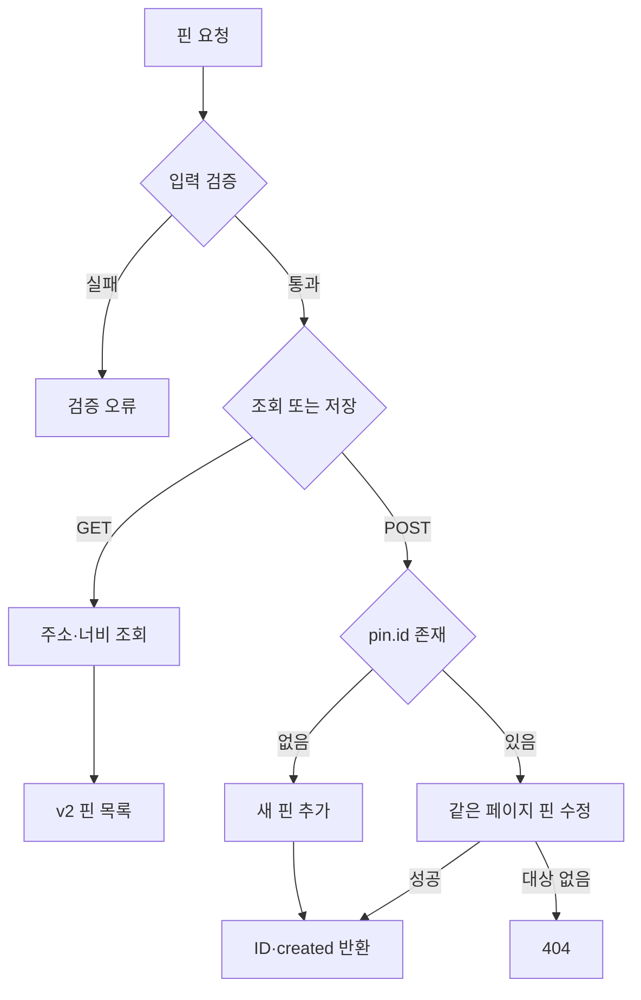
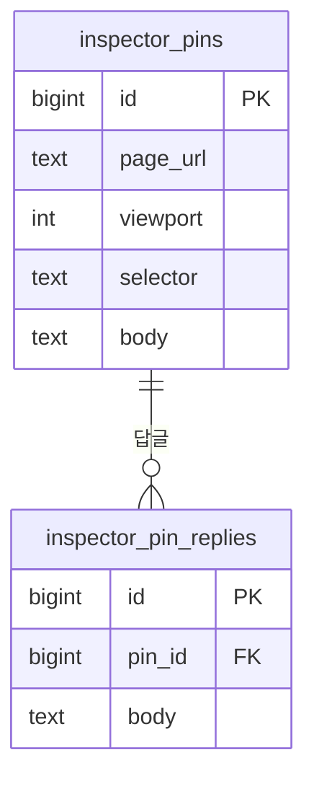

# ui-inspector — screen-code-handover 업데이트 인수인계

한국시간 2026년 9월 18~19일 업데이트 보고서. 활동 집계 마감은 9월 19일 21:24:15입니다.

화면의 위치에 핀을 찍고 의견을 남기는 도구입니다. 이번에는 화면편집기용 구성과 실제 핀 저장 서버가 추가됐습니다.

| 항목 | 기준 |
|---|---|
| 보고서 범위 | 이번 기간의 변경과 관련 기능. 전체 시스템 설명은 아래 기존 상세 문서로 연결합니다. |
| 확인 브랜치 | main |
| 소스 기준 | `80d9cff0ae15` |
| 검증 범위 | API·저장소·스키마·테스트 파일과 배포 안내를 정적으로 대조했습니다. 기존 자동화 기록만으로 운영 배포를 완료로 처리하지 않았습니다. |
| 보고서 세트 | [쉬운 설명](easy-guide.md) · [수정·검증 지시](fix-guide.md) · [코드 인수인계](screen-code-handover.md) |

## 이번 변경의 경계

- 9월 18일 인수인계 PDF를 추가했습니다.
- 9월 19일 댓글 패널 manifest·easy/fix 가이드를 추가하고 FastAPI 핀 조회·저장 서버를 구현했습니다.
- 배포 안내 커밋은 21:15에 작성됐고 PR #5의 병합은 집계 마감 직후 21:24:33입니다. 커밋 활동과 병합 시각을 구분합니다.

이번 업데이트의 핵심은 문서·계약·서버 처리입니다. 실행 화면을 새로 캡처하지 않았으며 확인하지 않은 화면을 실제 실행 결과로 제시하지 않습니다.

## 핵심 파일과 역할

| 핵심 파일 | 함수·컴포넌트 | 담당 역할 |
|---|---|---|
| [backend/app/main.py](https://github.com/feed-mina/ui-inspector/blob/80d9cff0ae15c40f1c5e5606b6beed66da6267ad/backend/app/main.py) | list_pins / save_pin / get_connection | HTTP 입력을 검사하고 저장소 함수에 넘깁니다. 요청 하나를 DB 트랜잭션으로 처리합니다. |
| [backend/app/repository.py](https://github.com/feed-mina/ui-inspector/blob/80d9cff0ae15c40f1c5e5606b6beed66da6267ad/backend/app/repository.py) | list_pins / save_pin / _row_to_pin | 조회·추가·수정과 계약 필드/DB 열 변환을 담당합니다. |
| [backend/app/schemas.py](https://github.com/feed-mina/ui-inspector/blob/80d9cff0ae15c40f1c5e5606b6beed66da6267ad/backend/app/schemas.py) | PinsSaveInput / PinOut | 요청·응답의 필드와 허용 범위를 정의합니다. |
| [backend/schema.sql](https://github.com/feed-mina/ui-inspector/blob/80d9cff0ae15c40f1c5e5606b6beed66da6267ad/backend/schema.sql) | inspector_pins / inspector_pin_replies | 핀과 답글의 저장 구조·외래키를 정의합니다. |

## 입력·처리·반환과 부수 효과

| 담당 기능 | 입력 | 처리와 분기 | 반환·출력 | 별도로 일어나는 변경 |
|---|---|---|---|---|
| GET list_pins | url, 선택 viewport | 주소·너비로 조회하고 답글을 묶음 | ok 봉투 안 v=2,url,viewport,pins | DB 읽기 |
| POST save_pin | url,viewport,pin | ID 없으면 추가, 있으면 같은 페이지의 해당 ID 수정 | {id,created} | DB 쓰기 |
| 없는 핀 수정 | 다른 페이지 또는 없는 ID | PinNotFound 감지 | 404 오류 봉투 | 변경 없음 |

## 동작 흐름

화살표는 호출·데이터 전달 또는 조건 분기를 뜻합니다. 도식에 없는 운영 연결은 확인되지 않았습니다.

## 데이터와 연결 관계

| 저장·전달 대상 | 주요 값 | 관계와 주의점 |
|---|---|---|
| inspector_pins | id,page_url,viewport,selector,offset_x,offset_y,fallback_x,fallback_y,body | 핀의 위치와 사람이 쓴 본문을 저장합니다. 대상 페이지 HTML 전체를 받지 않습니다. |
| inspector_pin_replies | id,pin_id,body,author | pin_id는 inspector_pins.id의 실제 외래키입니다. |
| 계약 변환 | s→selector, fx/fy→fallback_x/y, text→body | 조회용 선택자와 저장 본문을 구분합니다. |

schema.sql의 실제 외래키입니다. 핀 삭제 시 답글도 삭제되도록 선언돼 있지만 삭제 API와 답글 저장 API는 현재 구현돼 있지 않습니다.

## 유지보수와 확인 순서

| 바꾸거나 확인할 것 | 확인 위치와 기준 |
|---|---|
| 필드 변경 | schemas.py, repository.FIELD_TO_COLUMN, SQL, JSON 계약을 함께 대조합니다. |
| 운영 연결 | 기본 서버 주소와 실제 배포 주소, 허용 출처를 일치시킵니다. |
| 인증 경계 | 현재 API 자체는 인증을 요구하지 않습니다. backend README의 사내망/앞단 인증 조건을 지킵니다. |

backend 폴더에서 의존성을 설치한 뒤 `uvicorn app.main:app --port 8000`으로 로컬 실행하고 `pytest`로 계약 검사를 수행하는 절차가 있습니다. 이번에는 서버를 기동하거나 외부 저장 요청을 보내지 않았습니다.

## 검증 결과와 남은 범위

API·저장소·스키마·테스트 파일과 배포 안내를 정적으로 대조했습니다. 기존 자동화 기록만으로 운영 배포를 완료로 처리하지 않았습니다.

실제 도메인·HTTPS·앞단 인증, 운영 DB와 Studio 저장 왕복은 이번에 확인하지 않았습니다.

## 기존 상세 문서와 활동 근거

- [백엔드 사용법](https://github.com/feed-mina/ui-inspector/blob/80d9cff0ae15c40f1c5e5606b6beed66da6267ad/backend/README.md)
- [배포 안내](https://github.com/feed-mina/ui-inspector/blob/80d9cff0ae15c40f1c5e5606b6beed66da6267ad/backend/DEPLOY.md)
- [기존 쉬운 가이드](https://github.com/feed-mina/ui-inspector/blob/80d9cff0ae15c40f1c5e5606b6beed66da6267ad/docs/ui-inspector-sdui-easy-guide.html)
- [기존 수정 가이드](https://github.com/feed-mina/ui-inspector/blob/80d9cff0ae15c40f1c5e5606b6beed66da6267ad/docs/ui-inspector-sdui-fix-guide.html)

| 한국시간 | 커밋 | 기록된 작업 | 구분 |
|---|---|---|---|
| 09/19 21:15 | [80d9cff](https://github.com/feed-mina/ui-inspector/commit/80d9cff0ae15c40f1c5e5606b6beed66da6267ad) | docs(backend): 호스팅어 VPS 배포 순서를 적는다 | 변경 기록 |
| 09/19 20:44 | [6cee30d](https://github.com/feed-mina/ui-inspector/commit/6cee30d9f80ec80dc5e96840c69b54085d3aed86) | Merge pull request #4 from feed-mina/backend/fastapi-pins | 병합 기록 |
| 09/19 20:37 | [4ab2334](https://github.com/feed-mina/ui-inspector/commit/4ab23347594eb01cd1d590a2626c51ca228749a1) | feat(backend): 핀 저장 창구를 FastAPI 로 구현 | 변경 기록 |
| 09/19 16:34 | [dfe0ad2](https://github.com/feed-mina/ui-inspector/commit/dfe0ad243b0cbbb7db4e108b0d2ce6a3c12f22ab) | Merge pull request #3 from feed-mina/sdui/inspector-panel | 병합 기록 |
| 09/19 16:08 | [055993a](https://github.com/feed-mina/ui-inspector/commit/055993a1bdaf6bee00b433251591977cae1f0ee0) | docs(sdui): 댓글 패널 SDUI 패키지와 옮기기 가이드 2종 추가 | 변경 기록 |
| 09/18 19:14 | [ab89f8d](https://github.com/feed-mina/ui-inspector/commit/ab89f8d1b38af2d9f987cf9c0a5a226db74ba9d8) | Merge pull request #2 from feed-mina/copilot/create-handoff-documentation | 병합 기록 |
| 09/18 19:13 | [56f9a9d](https://github.com/feed-mina/ui-inspector/commit/56f9a9d81c906a23904bebabd783d5d276fb3bf4) | docs: add ui-inspector handover PDF | 변경 기록 |
